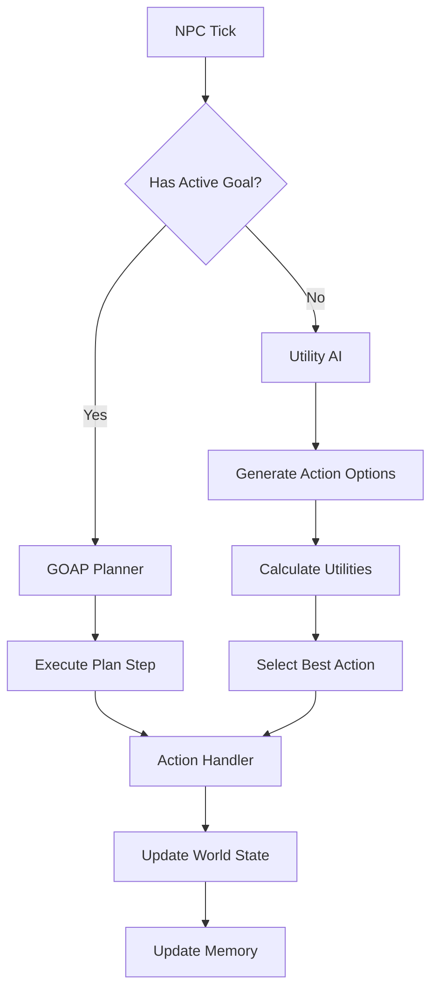

# AI Decision-Making System Documentation

## Overview

The TFOA AI system uses a hybrid approach combining **Utility AI** for reactive decision-making and **GOAP (Goal-Oriented Action Planning)** for long-term strategic planning. This creates NPCs that feel human-like while still being capable of complex, multi-step behaviors.

## Architecture



## Core Components

### 1. Personality System
NPCs have unique personalities that influence decision-making through traits like greed, laziness, sociability, and curiosity.

**Documentation:** [personality-system.md](./personality-system.md)

### 2. Utility AI
Reactive decision-making that evaluates immediate action options based on needs, economics, and personality.

**Documentation:** [utility-ai.md](./utility-ai.md)

### 3. GOAP Planner
Strategic planning for multi-step goals like building a house or accumulating wealth.

**Documentation:** [goap-system.md](./goap-system.md)

### 4. Memory System
NPCs remember resource locations, past actions, and interactions with other NPCs.

**Documentation:** [memory-system.md](./memory-system.md)

### 5. Spatial Awareness
Vision radius, pathfinding, and exploration behaviors.

**Documentation:** [spatial-awareness.md](./spatial-awareness.md)

### 6. Social Dynamics (Planned)
Relationships, cooperation, and NPC-to-NPC interactions.

**Documentation:** [social-dynamics.md](./social-dynamics.md)

## Decision-Making Flow

### 1. Context Analysis
```typescript
const context = ContextAnalyzer.analyzeNPC(npc);
// Returns: DESPERATE, STRUGGLING, STABLE, or THRIVING
```

### 2. Goal Selection (if applicable)
```typescript
if (!npc.activeGoal && npc.personality.traits.planfulness > 0.6) {
  npc.activeGoal = GoalManager.selectGoal(npc, world);
}
```

### 3. Action Decision
```typescript
if (npc.activeGoal) {
  // Use GOAP for strategic planning
  const plan = await GOAPPlanner.plan(currentState, goalState);
  action = plan[0];
} else {
  // Use Utility AI for reactive decisions
  const options = generateActionOptions(npc);
  action = UtilityAI.selectBest(options, npc);
}
```

### 4. Execution
```typescript
ActionManager.executeAction(npc, action, world);
```

### 5. Memory Update
```typescript
MemoryManager.remember(npc, {
  action: action,
  success: result.success,
  context: context
});
```

## Configuration

### Personality Archetypes
Located in: `simulation-core/src/personality/archetypes.ts`

Example:
```typescript
merchant: {
  greed: 0.8,
  laziness: 0.3,
  sociability: 0.7,
  riskTolerance: 0.6,
  planfulness: 0.7,
  curiosity: 0.4
}
```

### Utility Weights
Base weights (modified by personality and context):
- **Needs:** 0.5 (survival actions)
- **Economic:** 0.3 (wealth-building)
- **Social:** 0.2 (interactions)

### GOAP Actions
Located in: `simulation-core/src/goals/goap-actions.ts`

## Performance Characteristics

| Component | Time Complexity | Memory per NPC |
|-----------|----------------|----------------|
| Utility AI | O(n) actions | ~100 bytes |
| GOAP Planning | O(b^d) | ~500 bytes |
| Memory System | O(1) lookup | ~1 KB |
| Pathfinding | O(n log n) | ~200 bytes |

**Target:** <50ms decision time per NPC per tick

## Debugging & Monitoring

### Console Logging
```typescript
console.log(`${npc.name} decided: ${action} (U=${utility.toFixed(2)})`);
```

### Visualization (Future)
- Personality trait radar charts
- Decision tree visualization
- Memory map overlay

## Tuning Guide

### Making NPCs More Human-Like
1. Increase personality trait variance (±20% from archetype)
2. Add more randomness to utility calculations
3. Increase weight on social actions
4. Add "irrational" behaviors (curiosity, revenge)

### Making NPCs More Optimal
1. Reduce personality influence on weights
2. Increase planfulness trait
3. Prioritize economic utility
4. Reduce randomness in decisions

### Balancing
- **60% Human-like:** Personality-driven, some suboptimal choices
- **40% Optimal:** Efficient resource gathering, goal completion

## Common Issues

### NPCs stuck in loops
**Cause:** Utility values too similar  
**Solution:** Increase randomness, add action cooldowns

### NPCs ignoring urgent needs
**Cause:** Context weights not adapting  
**Solution:** Check ContextAnalyzer thresholds

### GOAP plans failing
**Cause:** Preconditions too strict  
**Solution:** Add fallback actions, relax preconditions

## Future Enhancements

1. **Emotion System:** Temporary mood states affecting decisions
2. **Learning:** NPCs improve strategies over time
3. **Communication:** NPCs share knowledge and coordinate
4. **Dynamic Goals:** Goals generated from world events

## References

- [Utility AI Theory](https://www.gdcvault.com/play/1012410/Improving-AI-Decision-Modeling-Through)
- [GOAP in Games](https://alumni.media.mit.edu/~jorkin/goap.html)
- [Personality in AI](https://www.gamedeveloper.com/design/giving-personality-to-game-ai)
