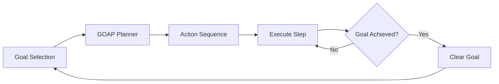

# GOAP System Documentation

## Overview

The Goal-Oriented Action Planning (GOAP) system enables NPCs to pursue complex, multi-step objectives by automatically generating action sequences to achieve desired world states.

## When to Use GOAP vs Utility AI

| Scenario | System | Reason |
|----------|--------|--------|
| Hungry, food in inventory | Utility AI | Simple, immediate action |
| Hungry, no food, need to gather | GOAP | Multi-step: find resource → pickup → eat |
| Want to own a house | GOAP | Complex: earn money → create contract → gather materials → build |
| Low energy | Utility AI | Simple: sleep |
| Want to become wealthy | GOAP | Long-term: gather → craft → sell (repeat) |

**Rule of Thumb:** Use GOAP for goals requiring 3+ steps, Utility AI for immediate needs.

## Architecture

### Core Components



### Data Structures

```typescript
// goals/goal-types.ts
export enum GoalType {
  OWN_HOUSE = 'own_house',
  ACCUMULATE_WEALTH = 'accumulate_wealth',
  MASTER_SKILL = 'master_skill',
  BUILD_RELATIONSHIP = 'build_relationship',
  EXPLORE_WORLD = 'explore_world'
}

export interface Goal {
  id: string;
  type: GoalType;
  priority: number;           // 0-1, higher = more important
  targetState: WorldState;    // Desired state to achieve
  deadline?: number;          // Optional tick deadline
  progress: number;           // 0-1, completion percentage
  plan?: string[];            // Current action plan
}

export interface WorldState {
  [key: string]: any;
  // Examples:
  // hasHouse: boolean
  // money: number (or ">= 100")
  // skill_crafting: number
}
```

## GOAP Algorithm

### A* Search Implementation

```python
# ai-service/goap.py
class GOAPPlanner:
    def plan(self, start_state: Dict, goal_state: Dict) -> List[str]:
        """
        Find shortest action sequence from start to goal using A*
        """
        queue = [(0, start_state, [])]  # (cost, state, plan)
        visited = set()
        
        while queue:
            cost, current_state, plan = heapq.heappop(queue)
            
            # Goal check
            if self.check_goal(current_state, goal_state):
                return plan
            
            # Avoid revisiting states
            state_key = tuple(sorted(current_state.items()))
            if state_key in visited:
                continue
            visited.add(state_key)
            
            # Try all applicable actions
            for action in self.actions:
                if action.is_valid(current_state):
                    new_state = action.apply(current_state)
                    new_cost = cost + action.cost
                    new_plan = plan + [action.name]
                    
                    # Heuristic: distance to goal
                    heuristic = self.estimate_distance(new_state, goal_state)
                    priority = new_cost + heuristic
                    
                    heapq.heappush(queue, (priority, new_state, new_plan))
        
        return []  # No plan found
```

### Action Definitions

```typescript
// goals/goap-actions.ts
export interface GOAPAction {
  name: string;
  preconditions: WorldState;  // What must be true to execute
  effects: WorldState;        // What changes after execution
  cost: number;               // Planning cost (not game cost)
}

export const GOAP_ACTIONS: GOAPAction[] = [
  {
    name: 'gather_money',
    preconditions: {},
    effects: { money: '+=50' },
    cost: 5
  },
  {
    name: 'create_house_contract',
    preconditions: { money: '>=100' },
    effects: { hasContract: true, money: '-=100' },
    cost: 2
  },
  {
    name: 'gather_wood',
    preconditions: { hasContract: true },
    effects: { wood: '+=10' },
    cost: 8
  },
  {
    name: 'gather_stone',
    preconditions: { hasContract: true },
    effects: { stone: '+=10' },
    cost: 8
  },
  {
    name: 'build_house',
    preconditions: { 
      hasContract: true, 
      wood: '>=20', 
      stone: '>=15' 
    },
    effects: { hasHouse: true },
    cost: 15
  }
];
```

## Goal Selection

### Priority System

```typescript
// goals/goal-manager.ts
export class GoalManager {
  selectGoal(npc: NPC, world: WorldManager): Goal | null {
    // Only planful NPCs set goals
    if (npc.personality.traits.planfulness < 0.5) {
      return null;
    }
    
    const candidates: Goal[] = [];
    
    // Survival goals (high priority)
    if (npc.needs.hunger > 0.8 && this.getInventoryFood(npc) === 0) {
      candidates.push({
        type: GoalType.GATHER_FOOD,
        priority: 0.95,
        targetState: { hasFood: true }
      });
    }
    
    // Economic goals
    if (npc.personality.traits.greed > 0.6) {
      candidates.push({
        type: GoalType.ACCUMULATE_WEALTH,
        priority: 0.7,
        targetState: { money: '>=500' }
      });
    }
    
    // Housing goals
    if (!npc.ownedBuildingIds.length && npc.stats.money >= 50) {
      candidates.push({
        type: GoalType.OWN_HOUSE,
        priority: 0.8,
        targetState: { hasHouse: true }
      });
    }
    
    // Exploration goals
    if (npc.personality.traits.curiosity > 0.7) {
      candidates.push({
        type: GoalType.EXPLORE_WORLD,
        priority: 0.5,
        targetState: { exploredTiles: '>=500' }
      });
    }
    
    // Select highest priority
    return candidates.sort((a, b) => b.priority - a.priority)[0] || null;
  }
}
```

## Integration with Simulation

### Decision Flow

```typescript
// world.ts
private async decideAction(npc: NPC) {
  // 1. Check for active goal
  if (!npc.activeGoal && npc.personality.traits.planfulness > 0.5) {
    npc.activeGoal = this.goalManager.selectGoal(npc, this);
  }
  
  // 2. If goal exists, use GOAP
  if (npc.activeGoal) {
    // Check if plan exists and is still valid
    if (!npc.activeGoal.plan || !this.isPlanValid(npc.activeGoal.plan, npc)) {
      // Request new plan from AI service
      const plan = await this.requestGOAPPlan(npc, npc.activeGoal);
      npc.activeGoal.plan = plan;
    }
    
    // Execute next step
    if (npc.activeGoal.plan && npc.activeGoal.plan.length > 0) {
      const nextAction = npc.activeGoal.plan[0];
      console.log(`${npc.name} executing plan: ${nextAction} (${npc.activeGoal.plan.length} steps remaining)`);
      npc.currentAction = nextAction;
      
      // Remove completed step
      npc.activeGoal.plan.shift();
      
      // Check goal completion
      if (this.isGoalAchieved(npc, npc.activeGoal)) {
        console.log(`${npc.name} achieved goal: ${npc.activeGoal.type}!`);
        npc.activeGoal = null;
      }
      
      return;
    }
  }
  
  // 3. Fall back to Utility AI
  const options = this.generateActionOptions(npc);
  const decision = await this.requestUtilityDecision(npc, options);
  npc.currentAction = decision.best_action?.name || null;
}
```

### State Extraction

```typescript
private getNPCState(npc: NPC): WorldState {
  return {
    // Resources
    money: npc.stats.money,
    wood: this.getInventoryCount(npc, 'tree_oak'),
    stone: this.getInventoryCount(npc, 'rock_stone'),
    food: this.getInventoryCount(npc, 'bush_berry'),
    
    // Capabilities
    hasContract: this.hasActiveContract(npc),
    hasHouse: npc.ownedBuildingIds.length > 0,
    
    // Skills
    skill_crafting: npc.skills.crafting,
    skill_gathering: npc.skills.gathering,
    
    // Exploration
    exploredTiles: npc.memory?.visitedLocations.size || 0
  };
}
```

## Example: Building a House

### Goal Definition
```typescript
const goal: Goal = {
  id: 'goal_house_1234',
  type: GoalType.OWN_HOUSE,
  priority: 0.8,
  targetState: { hasHouse: true },
  progress: 0
};
```

### Generated Plan
```
1. gather_money (if money < 100)
2. create_house_contract
3. gather_wood (repeat until wood >= 20)
4. gather_stone (repeat until stone >= 15)
5. build_house
```

### Execution Trace
```
Tick 100: NPC selects goal "OWN_HOUSE"
Tick 101: GOAP generates plan [gather_money, create_contract, gather_wood, ...]
Tick 102: Execute "gather_money" → money: 50 → 60
Tick 103: Execute "gather_money" → money: 60 → 70
...
Tick 120: Execute "create_contract" → hasContract: true, money: 100 → 0
Tick 121: Execute "gather_wood" → wood: 0 → 10
...
Tick 150: Execute "build_house" → hasHouse: true
Tick 151: Goal achieved! Clear activeGoal
```

## Performance Optimization

### Plan Caching
```typescript
// Cache plans to avoid re-planning
private planCache = new Map<string, string[]>();

private getCachedPlan(npc: NPC, goal: Goal): string[] | null {
  const key = `${npc.id}_${goal.type}_${JSON.stringify(goal.targetState)}`;
  return this.planCache.get(key) || null;
}
```

### Search Depth Limiting
```python
# Limit A* search depth to prevent infinite loops
MAX_SEARCH_DEPTH = 20
MAX_PLAN_LENGTH = 15

def plan(self, start_state, goal_state, max_depth=MAX_SEARCH_DEPTH):
    # ... A* search
    if len(plan) > MAX_PLAN_LENGTH:
        continue  # Skip overly long plans
```

### Incremental Planning
```typescript
// Re-plan only when world state changes significantly
private isPlanValid(plan: string[], npc: NPC): boolean {
  if (!plan || plan.length === 0) return false;
  
  const nextAction = this.getActionDefinition(plan[0]);
  const currentState = this.getNPCState(npc);
  
  // Check if preconditions still met
  return this.checkPreconditions(nextAction, currentState);
}
```

## Debugging

### Visualization
```typescript
console.log(`[GOAP] ${npc.name} planning for goal: ${goal.type}`);
console.log(`  Current state:`, currentState);
console.log(`  Target state:`, goal.targetState);
console.log(`  Generated plan:`, plan);
console.log(`  Estimated cost:`, totalCost);
```

### Common Issues

**Problem:** No plan found  
**Cause:** Missing action definitions or impossible goal  
**Solution:** Add intermediate actions, check preconditions

**Problem:** Plan too long (>15 steps)  
**Cause:** Inefficient action costs  
**Solution:** Adjust action costs, add shortcut actions

**Problem:** NPC stuck repeating same action  
**Cause:** Action effects not updating world state  
**Solution:** Verify action handlers update state correctly

## Testing

```typescript
describe('GOAP Planner', () => {
  it('finds optimal path to goal', () => {
    const start = { money: 0 };
    const goal = { hasHouse: true };
    
    const plan = planner.plan(start, goal);
    
    expect(plan).toEqual([
      'gather_money',
      'create_house_contract',
      'gather_wood',
      'gather_stone',
      'build_house'
    ]);
  });
  
  it('handles impossible goals gracefully', () => {
    const start = { money: 0, canWork: false };
    const goal = { hasHouse: true };
    
    const plan = planner.plan(start, goal);
    
    expect(plan).toEqual([]); // No valid plan
  });
});
```

## Future Enhancements

1. **Dynamic Action Costs:** Adjust based on NPC skills and world state
2. **Partial Plans:** Execute partial plans when full plan unavailable
3. **Plan Repair:** Modify existing plans instead of re-planning
4. **Multi-Agent Planning:** Coordinate goals between NPCs
5. **Learning:** Remember successful plans for similar goals

## References

- [GOAP in F.E.A.R.](https://alumni.media.mit.edu/~jorkin/goap.html)
- [Practical GOAP](https://gamedevelopment.tutsplus.com/goal-oriented-action-planning-for-a-smarter-ai--cms-20793t)
- [A* Algorithm](https://en.wikipedia.org/wiki/A*_search_algorithm)
