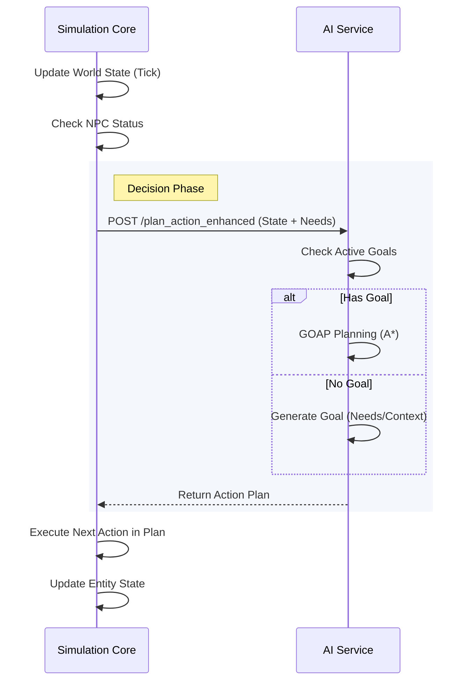

# System Architecture

## Overview
The simulation is built on a hybrid architecture separating the simulation state (TypeScript) from the AI decision-making (Python).

### Components

#### 1. Python AI Service (`ai-service/`)
**Role:** The "Brain"
- **Decision Making**: Handles all high-level AI logic (utility calculation + GOAP planning).
- **Goal Management**: Generates, prioritizes, and tracks NPC goals.
- **Action Planning**: Uses A* search to find optimal action sequences.
- **Economic Intelligence**: Evaluates craft vs. buy decisions based on market data.

#### 2. TypeScript Simulation Core (`simulation-core/`)
**Role:** The "Engine"
- **World State Management**: Tracks all entities, resources, NPCs, and buildings.
- **Action Execution**: Executes actions tick-by-tick and applies their effects.
- **Option Generation**: Provides available actions to the AI service.
- **Event Timeline**: Manages the simulation clock and event dispatching.

#### 3. Client UI (`client/`)
**Role:** The "Interface"
- **Visualization**: Renders the world state using React/Canvas.
- **Interaction**: Allows user to inspect NPCs and debug the system.

---

## Communication Flow

The system uses a request-response cycle driven by the Simulation Core:

## Data Flow
1.  **TypeScript**: Generates options and serializes world state.
2.  **Python**: Receives state, selects action (Utility) or plans sequence (GOAP).
3.  **TypeScript**: Executes the action, updates the world, and repeats.
